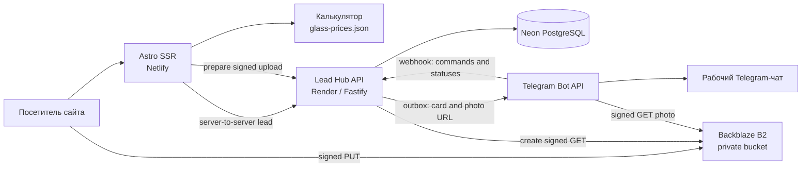

# Архитектура BelStekloExpert

Последняя актуализация: 28 июля 2026 года.

## Системный контекст



## Компоненты

| Компонент | Код | Ответственность |
| --- | --- | --- |
| Astro-сайт | `src/` | Страницы, SEO, калькулятор, формы и совместимые API routes |
| Данные сайта | `src/data/` | Контакты, часы, цены, бренды и данные калькулятора |
| Lead Hub | `apps/lead-hub/` | Приём лидов, idempotency, статусы, outbox и интеграции |
| PostgreSQL | Neon | Лиды, события и задачи интеграций |
| Object storage | Backblaze B2 | Приватные фотографии заявок |
| Telegram | Bot API | Оперативное рабочее уведомление мастера |
| Прайс pipeline | `scripts/update-glass-prices.mjs` | Импорт XLSX и генерация публичных диапазонов |

## Поток заявки без фотографии

```text
Browser form
  -> POST /api/lead/
  -> server validation
  -> Lead Hub POST /api/v1/leads/web
  -> PostgreSQL transaction
  -> success response and /spasibo/
  -> Lead Hub outbox worker
  -> Telegram card
```

Один `submission_id` проходит через весь поток как idempotency key. Повтор того же
запроса не должен создавать второй лид.

## Поток заявки с фотографией

```text
Browser
  -> compress and resize photo
  -> POST /api/uploads/prepare/
  -> Lead Hub creates short-lived signed PUT
  -> Browser uploads directly to private object storage
  -> Browser submits form with photo_refs
  -> Lead Hub stores refs with the lead
  -> Lead Hub outbox worker creates signed download URLs
  -> Telegram receives the card and photo
```

Ни bucket credentials, ни постоянный публичный URL не попадают в браузер. Signed URL
имеет короткий срок действия.

## Поток обновления калькулятора

```text
Private XLSX
  -> scripts/update-glass-prices.mjs
  -> validation and exclusions review
  -> src/data/glass-prices.json
  -> Astro build
  -> public model calculator
```

Внутренняя стоимость работ учитывается при расчёте, но не публикуется как отдельное
значение и не коммитится в исходный прайс.

## Deployment matrix

| Target | Конфигурация | Проверка |
| --- | --- | --- |
| Netlify Astro | `astro.config.mjs` | `npm run build` |
| Node Astro fallback | `astro.config.render.mjs` | `npm run build:render` |
| Render Lead Hub | `apps/lead-hub/` | `npm run lead-hub:check` |

Основной Netlify adapter и отдельный Node adapter должны сосуществовать. Подготовка
альтернативного deployment не должна заменять рабочую конфигурацию.

## Владение данными

| Данные | Источник истины |
| --- | --- |
| Контакты и реквизиты сайта | `src/data/` |
| Публичные диапазоны цен | `src/data/glass-prices.json` |
| Исходный прайс и review | `.private/` вне Git |
| Лиды и статусы | PostgreSQL |
| Фото | Приватный object storage |
| Секреты | Environment settings платформ |
| Текущая архитектура | `PROJECT_STATUS.md` и этот документ |

Astro-сайт не открывает собственное соединение с PostgreSQL. Совместимый endpoint
`/api/health/` проверяет готовность базы через публичный `/health/ready` Lead Hub и
возвращает только обобщённый статус без деталей подключения.

## Принципы

1. Сайт и Lead Hub разворачиваются независимо.
2. Сначала фиксируется лид, затем выполняются внешние интеграции.
3. Повтор запроса должен быть безопасным и идемпотентным.
4. Фото и PII не становятся публичными.
5. Внешний провайдер скрывается за S3-compatible storage adapter.
6. Миграции инфраструктуры выполняются с rollback-планом.
7. Формы сохраняют совместимый URL `/api/lead/`, а delivery provider остаётся
   скрыт за серверным контуром.
