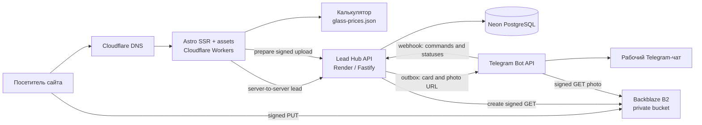

# Архитектура BelStekloExpert

Последняя актуализация: 28 сентября 2026 года.

## Системный контекст


```mermaid
flowchart LR
    USER["Посетитель сайта"]
    DNS["Cloudflare DNS"]
    SITE["Astro SSR + assets<br/>Cloudflare Workers"]
    CALC["Калькулятор<br/>glass-prices.json"]
    HUB["Lead Hub API<br/>Render / Fastify"]
    DB[("Neon PostgreSQL")]
    B2["Backblaze B2<br/>private bucket"]
    TG["Telegram Bot API"]
    CHAT["Рабочий Telegram-чат"]

    USER --> DNS --> SITE
    SITE --> CALC
    SITE -->|"server-to-server lead"| HUB
    SITE -->|"prepare signed upload"| HUB
    USER -->|"signed PUT"| B2
    HUB --> DB
    HUB -->|"outbox: card and photo URL"| TG
    TG -->|"webhook: commands and statuses"| HUB
    HUB -->|"create signed GET"| B2
    TG -->|"signed GET photo"| B2
    TG --> CHAT
```

## Instagram Messaging MVP (ingress включён, outbound выключен)

```text
Existing Meta webhook: Instagram DM
  -> raw-body HMAC verification + recipient allow-list
  -> integration_inbox (dedupe by message.mid)
  -> InboxProcessor retry/dead-letter
  -> PostgreSQL lead + Telegram human-card outbox (transaction 1)
  -> each DM + read-only provider history gate + first-reply decision
  -> eligible Instagram outbox (transaction 2)
  -> InstagramOutboxProcessor -> repeat history gate -> Instagram Login adapter
  -> sent + audit OR retry -> dead + Telegram escalation outbox
```

Два этапа фиксации восстанавливаются через тот же durable inbox; отправка
Instagram начинается только после commit DM/outbox. Каждый DM сохраняется
отдельно; первый ответ допускается только для действительно новой переписки,
не обработанной человеком. Telegram-worker выбирает только
своё destination. Лид остаётся доступным человеку независимо от auto-response.
Неизвестный исход отправки не повторяется автоматически: dead-letter и alert
предпочтительнее дублирования DM. Существующие таблицы и уникальные индексы
переиспользованы, второго ingress/БД нет. Facebook outbound не добавлен.
Решение: [ADR-0008](decisions/0008-instagram-messaging-mvp.md).
Rollout/settings/env/rollback: [runbook](meta-messaging-runbook.md).

## Локальная read-only граница Instagram Graph

`META_INSTAGRAM_ACCESS_TOKEN` хранится отдельно от Ads-токенов и используется
в `apps/lead-hub/src/integrations/instagram.ts` для проверки identity через
фиксированный `graph.instagram.com`. Команда `instagram:check` не выводит токен,
ID или username и не выполняет публикацию, отправку сообщений или изменение
настроек. Отдельный `instagram-messaging.ts` использует этот Instagram Login token
для отправки только при `INSTAGRAM_MESSAGING_ENABLED=true`. Код развёрнут на
Render в commit `097efdd`: ingress включён, но
`INSTAGRAM_MESSAGING_ENABLED=false`. Fail-closed проверка истории Instagram
выполняется перед постановкой и отправкой первого ответа. Canary нового диалога
после релиза не выполнен. `META_WRITE_MODE=off` и Ads MCP не изменены.

## Компоненты

| Компонент | Код | Ответственность |
| --- | --- | --- |
| Astro-сайт | `src/` | Страницы, SEO, калькулятор, формы и совместимые API routes |
| Cloudflare Worker | `astro.config.cloudflare.production.mjs` | Production SSR, static assets и server-side API сайта |
| Данные сайта | `src/data/` | Контакты, часы, цены, бренды и данные калькулятора |
| Lead Hub | `apps/lead-hub/` | Приём лидов, idempotency, статусы, outbox и интеграции |
| PostgreSQL | Neon | Лиды, события и задачи интеграций |
| Object storage | Backblaze B2 | Приватные фотографии заявок |
| Telegram | Bot API | Оперативное рабочее уведомление мастера |
| Прайс pipeline | `scripts/update-glass-prices.mjs` | Импорт XLSX и генерация публичных диапазонов |

## Поток заявки без фотографии

```text
Browser form
  -> POST /api/lead/
  -> server validation
  -> Lead Hub POST /api/v1/leads/web
  -> PostgreSQL transaction
  -> success response and /spasibo/
  -> Lead Hub outbox worker
  -> Telegram card
```

Один `submission_id` проходит через весь поток как idempotency key. Повтор того же
запроса не должен создавать второй лид.

## Поток заявки с фотографией

```text
Browser
  -> compress and resize photo
  -> POST /api/uploads/prepare/
  -> Lead Hub creates short-lived signed PUT
  -> Browser uploads directly to private object storage
  -> Browser submits form with photo_refs
  -> Lead Hub stores refs with the lead
  -> Lead Hub outbox worker creates signed download URLs
  -> Telegram receives the card and photo
```

Ни bucket credentials, ни постоянный публичный URL не попадают в браузер. Signed URL
имеет короткий срок действия.

## Поток обновления калькулятора

```text
Private XLSX
  -> scripts/update-glass-prices.mjs
  -> validation and exclusions review
  -> src/data/glass-prices.json
  -> Astro build
  -> public model calculator
```

Внутренняя стоимость работ учитывается при расчёте, но не публикуется как отдельное
значение и не коммитится в исходный прайс.

## Deployment matrix

| Target | Конфигурация | Проверка |
| --- | --- | --- |
| Cloudflare production | `astro.config.cloudflare.production.mjs` | `npm run build:cloudflare:production`, production dry-run |
| Cloudflare preview | `astro.config.cloudflare.mjs` | `npm run build:cloudflare`, preview smoke |
| Legacy Netlify fallback | `astro.config.mjs` | `npm run build` при изменении общей runtime-логики |
| Node Astro fallback | `astro.config.render.mjs` | `npm run build:render` при изменении общей runtime-логики |
| Render Lead Hub | `apps/lead-hub/` | `npm run lead-hub:check` |

Cloudflare production и preview являются отдельными Workers. Legacy Netlify и Node
конфигурации сохраняются для rollback/совместимости, но не определяют текущий
production-путь.

## Владение данными

| Данные | Источник истины |
| --- | --- |
| Контакты и реквизиты сайта | `src/data/` |
| Публичные диапазоны цен | `src/data/glass-prices.json` |
| Исходный прайс и review | `.private/` вне Git |
| Лиды и статусы | PostgreSQL |
| Фото | Приватный object storage |
| Секреты | Environment settings платформ |
| Текущая архитектура | `PROJECT_STATUS.md` и этот документ |

Astro-сайт не открывает собственное соединение с PostgreSQL. Совместимый endpoint
`/api/health/` проверяет готовность базы через публичный `/health/ready` Lead Hub и
возвращает только обобщённый статус без деталей подключения.

## Принципы

1. Сайт и Lead Hub разворачиваются независимо.
2. Сначала фиксируется лид, затем выполняются внешние интеграции.
3. Повтор запроса должен быть безопасным и идемпотентным.
4. Фото и PII не становятся публичными.
5. Внешний провайдер скрывается за S3-compatible storage adapter.
6. Миграции инфраструктуры выполняются с rollback-планом.
7. Формы сохраняют совместимый URL `/api/lead/`, а delivery provider остаётся
   скрыт за серверным контуром.
