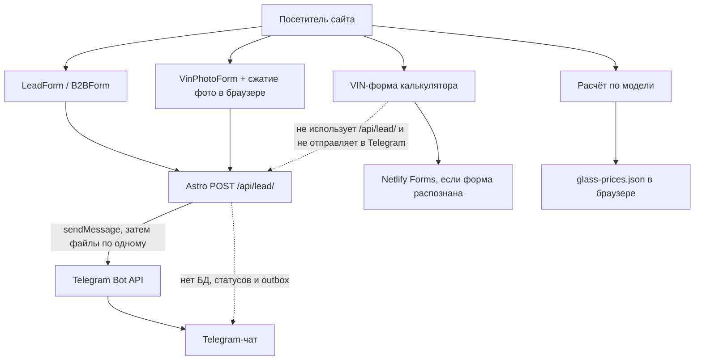
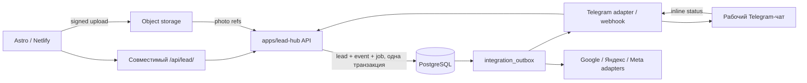

# Аудит текущего контура заявок BelStekloExpert

Дата аудита: 10 июля 2026 года
Этап: `CODEX-0`
Репозиторий: `https://github.com/liber10/belstekloexpert-astro.git`
Проверенная ветка: `main`, commit `5c115b8`

## 1. Итог в одном абзаце

Сейчас проект представляет собой Astro-сайт, который разворачивается на Netlify в
режиме SSR. Отдельного Telegram-бота или backend-сервиса в репозитории нет: есть
только серверный endpoint `/api/lead/`, который синхронно вызывает Telegram Bot API
и отправляет текст заявки, а затем фото. PostgreSQL, статусов, дедупликации,
идемпотентности, очереди, повторных попыток и истории лида нет. Дополнительно в
калькуляторе существует отдельная VIN-форма Netlify Forms, не связанная с этим
endpoint и Telegram. Поэтому расширять «существующий backend/бот» фактически
нечего: рекомендуемый путь — создать в этом репозитории самостоятельный сервис
`apps/lead-hub`, а текущий `/api/lead/` временно сохранить как совместимый вход для
плавного переключения форм.

## 2. Границы и источники аудита

Проверены реальные файлы текущего checkout:

- структура репозитория и `git status`;
- `package.json`, `astro.config.mjs`, `netlify.toml`, `.env.example`, `.gitignore`;
- все компоненты форм и места их использования;
- единственный API route и Telegram-клиент;
- аналитика, UTM, контакты, privacy-страница и публичные machine-readable файлы;
- наличие backend, базы, Docker, reverse proxy, CI, тестов и bot framework;
- текущие tracked-файлы и история Git по очевидным сигнатурам bot token/private key.

В корне проекта нет `AGENTS.md` и `README`. Производственные значения переменных
Netlify и настройки кабинетов недоступны из репозитория, поэтому их наличие нельзя
подтвердить этим аудитом. Локальных `.env` и `.env.local` нет; значения Telegram и
аналитики не установлены в окружении текущего терминала.

## 3. Где находится сайт и как он развёрнут

| Параметр | Фактическое состояние |
| --- | --- |
| Локальный путь | `C:\Users\PC\codex\belstekloexpert-astro` |
| Git remote | `origin -> https://github.com/liber10/belstekloexpert-astro.git` |
| Основная ветка | `main`, синхронизирована с `origin/main` на момент начала аудита |
| Framework | Astro `6.4.6`, TypeScript `5.8.3` |
| Runtime | Node.js `22` в `netlify.toml` |
| Astro mode | `output: 'server'` |
| Adapter | `@astrojs/netlify` |
| Build | `npm run build` -> `astro check && astro build` |
| Публикация | Netlify; известный URL текущего сайта: `https://comfy-profiterole-37ba97.netlify.app/` |
| Canonical в коде | `https://belstekloexpert.by` |
| Custom domain | по подтверждению владельца пока не подключён |
| CI в репозитории | отсутствует; `.github/workflows` нет |

Важно для запуска рекламы: canonical URL, JSON-LD, sitemap и robots уже указывают на
`belstekloexpert.by`, тогда как фактически доступен Netlify URL. До закупки трафика
нужно подключить основной домен либо осознанно временно привести все рекламные и
аналитические URL к одному адресу.

## 4. Текущий поток данных

### Фактические свойства потока

- Telegram является единственным постоянным рабочим местом для заявок, прошедших
  через `/api/lead/`.
- До успешной отправки в Telegram заявка нигде не фиксируется.
- Текст Telegram отправляется первым, фото — последовательными отдельными запросами.
- `leadId` создаётся из времени и `Math.random()`, возвращается клиенту и больше
  нигде не хранится.
- Нет входящего Telegram webhook, polling, inline-кнопок, команд или смены статуса.
- Локальная папка `.netlify/db` относится к Netlify Dev и не используется кодом как
  прикладная PostgreSQL-база Lead Hub.

## 5. Инвентаризация форм и success-сценариев

| Поток | Где используется | Поля | Endpoint | Успех | Проблемы |
| --- | --- | --- | --- | --- | --- |
| `LeadForm.astro` | страницы услуг через `ServiceLayout`, `/ceny/`, `/kontakty/` | service, phone, name, comment, page URL, 5 UTM, honeypot | `POST /api/lead/` | native POST -> `303 /spasibo/?leadId=...` | нет idempotency, click IDs, consent и server-side лимитов текста |
| `B2BForm.astro` | `/dlya-yurlic/` | те же поля, специальный service/event | `POST /api/lead/` | тот же | не собирает компанию, УНП, парк, email или объём работ |
| `VinPhotoForm.astro` | все услуги, `/marki/`, страницы марок и моделей | phone, contact method, make, model, year, glass type, VIN, comment, до 5 фото, page URL, 5 UTM | `POST /api/lead/` через `fetch` | JSON success -> локальный `lead_success` -> redirect на `/spasibo/` | `lead_success` повторно отправляется на thank-you page; нет idempotency |
| Расчёт по модели в `GlassCalculator.astro` | `/` и `/kalkulyator/` | тип, марка, модель, год, еврокод | endpoint отсутствует | только показывает диапазон из `glass-prices.json` | выбор не сохраняется, лид и события шагов не создаются |
| VIN-форма в `GlassCalculator.astro` | `/` и `/kalkulyator/` | VIN, decoded vehicle, phone, comment, Netlify honeypot | отдельная Netlify Form без `action` | зависит от стандартного Netlify Forms flow | нет Telegram pipeline, UTM, page URL, click IDs и заданной thank-you страницы |
| `QuickContactForm.astro` | не используется | обёртка `LeadForm` | `POST /api/lead/` | тот же | мёртвый компонент |

### Риск VIN-формы калькулятора

Главная и `/kalkulyator/` не пререндерятся в статический HTML при текущем server
output. В `dist` нет соответствующих статических страниц, а Netlify Forms обычно
регистрирует формы при анализе deploy HTML. Поэтому исходники не подтверждают, что
форма `glass-vin-request` вообще зарегистрирована в production. Даже если Netlify
её принимает, заявка попадает в отдельное хранилище Netlify Forms, а не в текущий
Telegram-поток. Это первый кандидат на унификацию.

## 6. Текущий `/api/lead/`

Файлы:

- `src/pages/api/lead.ts` — приём multipart form data и ответы;
- `src/lib/validation.ts` — телефон и фото;
- `src/lib/telegram.ts` — формат сообщения и Bot API;
- `src/components/forms/VinPhotoForm.astro` — browser-side сжатие JPG/PNG/WebP.

Что работает и пригодно для переиспользования:

- server-only чтение `TELEGRAM_BOT_TOKEN` и `TELEGRAM_CHAT_ID`;
- honeypot `company` у основных форм;
- единый набор подписей полей для Telegram;
- до 5 фото, не более 10 МБ каждое;
- browser-side уменьшение изображений до ориентировочно 2 МБ и 1600 px;
- безопасное имя файла перед отправкой;
- `parse_mode` не используется, поэтому пользовательский текст не интерпретируется
  Telegram как HTML/Markdown;
- понятный redirect на собственную thank-you страницу у API-форм.

Что отсутствует:

- база и транзакционная фиксация лида до внешнего вызова;
- нормализация телефона в E.164;
- общая typed/schema validation;
- idempotency key и дедупликация;
- rate limit, allowlist origin, ограничение полного request body до `formData()`;
- timeout, retry/backoff и outbox для Telegram;
- structured logging, health endpoints, metrics и alerting;
- хранение event timeline и статусов;
- безопасное object storage для фото и постоянные `photo_refs`.

## 7. Telegram: что существует на самом деле

В репозитории нет реализации Telegram-бота в обычном смысле:

- нет Telegraf, grammY, `node-telegram-bot-api` или собственного update router;
- нет webhook/polling процесса;
- нет обработчиков команд и callback query;
- нет пользователей, ролей, назначений и SLA;
- нет deploy-конфигурации отдельного Telegram-процесса;
- нет хранилища статусов.

Есть только исходящий adapter `sendLeadToTelegram()`, вызывающий `sendMessage`,
`sendPhoto` и `sendDocument`. Публичная ссылка `https://t.me/belstekloexpert` не
доказывает, что это тот же bot, чей token используется в Netlify. Перед `CODEX-1`
нужно проверить владельца bot token и убедиться, что этот bot сейчас не обслуживается
другим polling/webhook процессом: Telegram допускает только один активный webhook
для token, а polling и webhook нельзя бесконфликтно использовать одновременно.

## 8. Аналитика и атрибуция

### Уже реализовано

- условная загрузка GTM через `PUBLIC_GTM_ID`;
- условная загрузка GA4 через `PUBLIC_GA4_ID`;
- условная загрузка Яндекс Метрики через `PUBLIC_YANDEX_METRIKA_ID`;
- общий `window.bseTrack()`, отправляющий событие в `dataLayer`, direct `gtag` и
  `ym(..., 'reachGoal')`;
- сохранение пяти `utm_*` из URL в `localStorage`;
- перенос сохранённых UTM и текущего `page_url` в две основные формы;
- click events для телефона, маршрута, Telegram, Viber, Instagram, калькулятора,
  отзывов и скачивания КП;
- Yandex Webmaster verification meta и verification file.

### Не реализовано

- Meta Pixel/Dataset и Meta events;
- consent manager, cookie preferences и блокировка аналитики до согласия;
- юридически согласованная privacy policy — текущая страница прямо обозначена как
  временная заготовка;
- `gclid`, `gbraid`, `wbraid`, `yclid`, `fbclid`;
- GA Client ID и Яндекс ClientID;
- отдельные landing URL и referrer;
- `consent_at` и версия политики;
- first-touch/last-touch модель и срок жизни сохранённой атрибуции;
- перенос атрибуции в VIN-форму калькулятора;
- требуемые события `calculator_start`, `calculator_step`, `photo_submit`,
  `lead_submit`, `form_error`;
- backend-события `qualified`, `booked`, `won` и обратные конверсии.

### Ошибки семантики событий

- submit-событие основной формы фиксируется до получения ответа сервера, то есть
  может считаться лидом даже при ошибке Telegram;
- `VinPhotoForm` отправляет `lead_success` после ответа API, затем `/spasibo/`
  отправляет `lead_success` повторно;
- выбор фото называется `photo_select`, но нет отдельного подтверждённого
  `photo_submit`;
- режим расчёта по модели не отправляет `calculator_start` и шаги калькулятора;
- одновременная настройка direct GA4 и того же GA4 через GTM может дать дубли, если
  контейнер не настроен с учётом этого.

## 9. Контакты, ссылки и UTM: места использования

### Основные источники данных

- `src/data/contacts.ts` — телефон, tel-link, Telegram, Viber, Instagram, карты,
  адрес и координаты;
- `src/data/site.ts` — юридические данные, email, повтор телефона и части адреса,
  домен и путь к КП;
- `src/data/business-hours.ts` — режим работы;
- `src/lib/schema.ts` — Organization/AutoRepair schema;
- `src/layouts/BaseLayout.astro` — UTM, аналитика и click tracking.

### Дубли, которые могут разойтись

- телефон и адрес одновременно находятся в `contacts.ts` и `site.ts`;
- контакты повторены вручную в `public/llms.txt`;
- контакты и реквизиты повторены в `scripts/generate-commercial-offer.py` и
  сгенерированном PDF;
- список UTM трижды задан вручную: в `BaseLayout`, `LeadForm`/`VinPhotoForm` и
  `/api/lead`; `src/lib/utm.ts` фактически не переиспользуется этими местами.

### Компоненты, через которые расходятся ссылки

- `Header.astro`, `Footer.astro`, `StickyCallBar.astro`;
- `MessengerButtons.astro`;
- `Hero.astro`, `MapBlock.astro`, `FinalCTA.astro`;
- `/kontakty/`, `/otzyv/`, `/o-kompanii/`;
- JSON-LD и `public/llms.txt`.

## 10. Backend и эксплуатационная инфраструктура

| Компонент | Состояние |
| --- | --- |
| Самостоятельный backend | отсутствует |
| PostgreSQL приложения | отсутствует |
| ORM и migrations | отсутствуют |
| Redis/queue | отсутствуют |
| Outbox/retry | отсутствуют |
| Docker/Docker Compose | отсутствуют |
| Reverse proxy/TLS config | отсутствует |
| Health endpoints | отсутствуют |
| Error tracking | отсутствует |
| Structured logs | отсутствуют |
| Unit/integration/e2e tests | отсутствуют |
| ESLint/lint script | отсутствует |
| CI/CD workflow | отсутствует; деплой Netlify идёт вне файлов CI этого repo |
| Backup/restore | отсутствует, так как прикладной БД пока нет |

## 11. Риски безопасности и надёжности

### Высокий приоритет

1. **Заявка не фиксируется до Telegram.** Любой timeout/сбой Telegram означает
   отсутствие записи, по которой можно восстановить лид.
2. **Частичная доставка создаёт дубли.** Текст или часть фото могут уже находиться
   в чате, хотя endpoint вернул `502`; повтор клиента создаёт новый `leadId` и
   дублирует заявку.
3. **Открытый endpoint без rate limit.** Honeypot легко обходится; нет origin check,
   IP/device throttling, CAPTCHA/turnstile fallback или квоты на источник.
4. **Нет idempotency.** Double click, повтор browser request или retry CDN создаёт
   независимые Telegram-сообщения.
5. **Нет готового правового основания для аналитики и PII.** VIN, телефон, фото и
   маркетинговые идентификаторы обрабатываются без consent timestamp, retention и
   утверждённой privacy policy.
6. **Отдельная VIN-форма калькулятора.** Её production-регистрация не подтверждается
   текущим SSR build, а успешная заявка в любом случае не попадает в общий Telegram
   pipeline.

### Средний приоритет

1. `request.formData()` вызывается до собственного ограничения полного multipart
   body; лимиты применяются уже к загруженным `File`.
2. MIME фото доверяется клиенту; magic bytes и содержимое файла не проверяются.
3. Нет ограничений длины VIN, имени, комментария, UTM и URL на сервере.
4. Телефон проверяется только по числу цифр от 9 до 15 и не нормализуется.
5. Текст ответа Telegram API возвращается клиенту в error message; внешние детали
   не должны попадать в публичный production response.
6. Нет timeout для Telegram `fetch`, retry, circuit breaker и dead-letter состояния.
7. Нет SLA-alert, мониторинга очереди, healthcheck и наблюдаемости.
8. Нет CSP и иных явно заданных security headers в `netlify.toml`.
9. Атрибуция неполная и может потерять/задвоить конверсии.
10. Custom domain в SEO-конфигурации не соответствует текущему фактическому URL.

### Положительные наблюдения

- реальные Telegram token/chat ID не находятся в tracked-файлах;
- `.env`, `.env.local`, `.netlify`, `.private`, логи и build output исключены через
  `.gitignore`;
- в текущем дереве обнаружены только имена секретных переменных, без значений;
- простой поиск по истории не обнаружил строк, похожих на Telegram bot token или
  private key;
- Telegram credentials читаются только в server-side модуле;
- фото ограничены по типу, количеству и размеру после parsing;
- пользовательский текст не включается в HTML/Markdown parse mode Telegram.

Это не заменяет специализированный secret scanner перед production, особенно если
будут добавляться токены рекламных платформ.

## 12. Что можно переиспользовать

| Существующий элемент | Решение |
| --- | --- |
| URL `/api/lead/` | сохранить как compatibility proxy на время миграции |
| Поля `LeadForm` и `VinPhotoForm` | использовать как исходную web schema, затем расширить attribution/consent |
| Сжатие фото в браузере | оставить как UX-оптимизацию, но добавить безопасный upload flow |
| `buildTelegramMessage` и русские подписи | перенести в Telegram adapter Lead Hub |
| Honeypot | оставить как первый дешёвый фильтр, но не считать защитой |
| UTM localStorage | заменить общим attribution module с click IDs, сроком жизни и consent |
| `bseTrack` | сохранить как frontend facade, выровнять имена и момент отправки событий |
| Netlify + Astro | оставить frontend-платформой; перенос сайта на VPS не нужен |
| `.env.example` | расширить безопасными именами переменных без значений |

## 13. Что нужно заменить или добавить

- прямой synchronous Telegram delivery -> транзакция в PostgreSQL + outbox worker;
- случайный эфемерный `leadId` -> UUID и человекочитаемый public number;
- разрозненные формы -> единый typed payload и idempotency key;
- Netlify VIN form -> общий `/api/lead/`/Lead Hub flow;
- фото внутри запроса к Telegram -> presigned upload в object storage и `photo_refs`;
- простой outbound Telegram adapter -> bot webhook, callback handlers, команды и роли;
- UTM-only tracking -> полный attribution context;
- submit tracking -> confirmed frontend/backend lifecycle events;
- временную privacy page -> согласованную политику, consent и retention;
- ручное наблюдение -> health, structured logs, outbox metrics и alerts;
- отсутствие тестов/CI -> unit, integration, migration check и smoke tests.

## 14. Рекомендуемая архитектура

Так как пригодного bot/backend нет, создать сервис `apps/lead-hub` в существующем
репозитории и не переносить Astro-сайт.

Рекомендуемый MVP:

- Node.js LTS + TypeScript;
- Fastify для API, schema validation, body limits и rate limiting;
- PostgreSQL;
- Drizzle ORM и SQL migrations;
- PostgreSQL outbox без Redis на первом этапе;
- grammY или тонкий Telegram adapter для webhook/commands/callback query;
- S3-compatible object storage с короткоживущими signed upload URL для фото;
- Vitest + integration tests с отдельной test database;
- Docker Compose только для локальной разработки;
- отдельный production runtime с постоянным процессом и HTTPS.

Почему сервис нужен отдельно от Netlify function:

- требуется постоянный worker для outbox, SLA и daily reports;
- Telegram webhook и callback processing должны иметь стабильный endpoint;
- PostgreSQL становится источником истины;
- рекламные adapters и scheduled jobs не должны зависеть от frontend deploy;
- Astro можно обновлять и откатывать независимо от очереди лидов.

## 15. План миграции без простоя

### Фаза 0. Решения и доступы

- подтвердить bot/token ownership и отсутствие стороннего polling/webhook;
- выбрать hosting, PostgreSQL, object storage, домен Lead Hub и test Telegram chat;
- утвердить статусы, роли, SLA, retention и privacy;
- зафиксировать baseline: число тестовых форм и текущий Telegram-формат.

### Фаза 1. Изолированный Lead Hub MVP

- добавить `apps/lead-hub` без изменения production forms;
- реализовать migrations, health, `POST /api/v1/leads/web`, outbox и test chat;
- проверить idempotency повторным fixture/curl;
- Telegram webhook сначала подключить к отдельному test bot или test chat.

### Фаза 2. Совместимый переключатель на сайте

- оставить публичный URL `/api/lead/`;
- добавить server-to-server client к Lead Hub с ingest secret;
- переключать `legacy|hub` через env, не через изменение каждой страницы;
- использовать один idempotency key от браузера до БД;
- при rollback вернуть `legacy`, не удаляя принятые Hub-лиды.

Автоматический fallback «послать ещё и напрямую в Telegram» после timeout не нужен:
он создаёт дубли, если Lead Hub уже принял запрос. Источник истины должен отвечать
идемпотентно, а Telegram доставляться outbox worker.

### Фаза 3. Унификация frontend

- перевести VIN-форму калькулятора на общую typed schema;
- добавить model selection в payload при запросе контакта;
- добавить click IDs, landing/referrer, Client IDs и consent;
- заменить multipart Telegram flow на signed upload;
- выровнять loading/success/error и analytics events.

### Фаза 4. Рабочий Telegram bot

- inline statuses и immutable `lead_events`;
- `/new`, `/today`, `/sla`, `/funnel`;
- роли и назначение ответственного;
- SLA jobs и ежедневные отчёты;
- только после этого подключать conversion outbox.

### Фаза 5. Внешние каналы

- Meta Lead Ads;
- Google/Yandex offline conversions в dry-run;
- телефония после выбора официального provider webhook;
- Kufar/Onliner только разрешённым email/manual flow.

## 16. Недостающие доступы и решения владельца

Нужно заполнить до `CODEX-1`:

1. Кто владелец текущего Telegram bot token и где ещё он используется.
2. Отдельные production/test bot и chat/group ID либо согласованный безопасный режим
   тестирования одного bot.
3. Кто будет Telegram admin, manager и read-only observer.
4. Где размещать Lead Hub: VPS/managed Node, регион, резервный доступ.
5. Где размещать PostgreSQL и кто отвечает за backup/restore.
6. Поддомен API, например `leads.belstekloexpert.by`, и доступ к DNS/TLS.
7. Object storage, допустимый срок хранения фото/VIN и процедура удаления PII.
8. Утверждённая privacy policy, consent text и версия документа.
9. SLA первого ответа, эскалации и рабочие роли.
10. Производственная ёмкость, статусы воронки и обязательные причины потери.
11. Подключение основного домена `belstekloexpert.by` к Netlify до рекламного запуска.
12. Доступы владельца/резервного администратора к Netlify, GitHub и домену.
13. Реальные GTM, GA4, Метрика, Pixel/Dataset IDs и владельцы кабинетов.
14. Выбранная телефония, номера источников и наличие официального webhook.
15. Нужен ли импорт уже накопленных Netlify Forms/Telegram заявок или новая БД
    начинается с даты запуска.

## 17. Решение по следующему этапу

Рекомендация: принять архитектуру `apps/lead-hub` в этом репозитории, PostgreSQL как
источник истины и текущий `/api/lead/` как временный compatibility proxy. После
ответов по Telegram token ownership, hosting/PostgreSQL и test chat можно начинать
`CODEX-1` отдельным атомарным изменением. Телефонию выбирать до `CODEX-5`, но её
провайдера не нужно ждать для MVP web -> database -> Telegram.

## 18. Проверки CODEX-0

- рабочее дерево до аудита было чистым;
- просмотрены все tracked source/config files, связанные с формами, Telegram,
  аналитикой, контактами и deploy;
- обнаружен один Astro API route и два независимых form pipelines;
- отдельный bot/backend, app database, migrations, Docker, CI и тесты не найдены;
- очевидных bot token/private key в текущем tracked tree не найдено;
- `npm run check`: 67 Astro-файлов, 0 ошибок, 0 предупреждений, 0 hints;
- `npm run build`: production Netlify SSR build завершён успешно;
- lint, unit и integration tests не запускались, потому что соответствующих scripts
  и test suites в проекте нет;
- внешние кабинеты, production env и live submissions не изменялись;
- в рамках этапа создаётся только этот отчёт.
